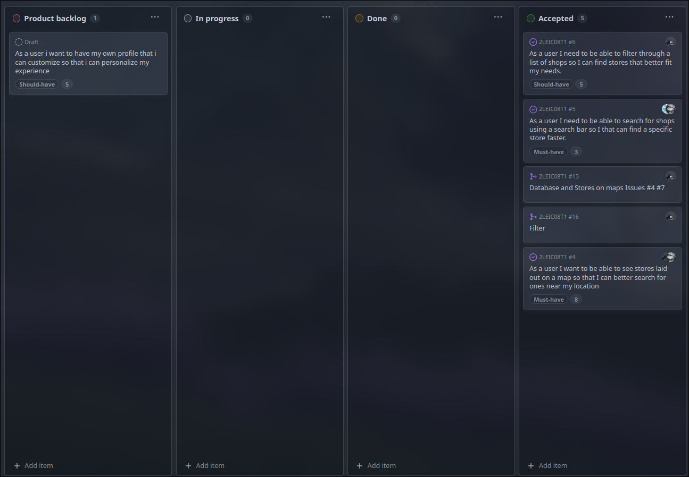

# EcoFinder Development Report

Welcome to the documentation pages of EcoFinder!

This Software Development Report, tailored for LEIC-ES-2024-25, provides comprehensive details about EcoFinder, from high-level vision to low-level implementation decisions. It’s organised by the following activities.

- [EcoFinder Development Report](#ecofinder-development-report)
  - [Business Modelling](#business-modelling)
    - [Product Vision](#product-vision)
    - [Features and Assumptions](#features-and-assumptions)
    - [Elevator Pitch](#elevator-pitch)
  - [Requirements](#requirements)
    - [User Stories](#user-stories)
    - [Domain model](#domain-model)
  - [Architecture and Design](#architecture-and-design)
    - [Logical architecture](#logical-architecture)
    - [Physical architecture](#physical-architecture)
    - [Vertical prototype](#vertical-prototype)
  - [Project management](#project-management)
    - [Sprint 0](#sprint-0)
    - [Sprint 1](#sprint-1)
    - [Sprint 2](#sprint-2)
    - [Sprint 3](#sprint-3)

Contributions are expected to be made exclusively by the initial team, but we may open them to the community, after the course, in all areas and topics: requirements, technologies, development, experimentation, testing, etc.

Please contact us!

Thank you!

- Arnaldo Ferraz Lopes, up202307659@fe.up.pt
- Diogo Sousa Campeão, up202307177@fe.up.pt
- José Pedro Marques Ferreira, up202305478@fe.up.pt
- Miguel Borges Pereira, up202304387@fe.up.pt
- Sérgio Miguel Cardoso Almeida, up202305946@fe.up.pt

---

## Business Modelling

Business modeling in software development involves defining the product's vision, understanding market needs, aligning features with user expectations, and setting the groundwork for strategic planning and execution.

### Product Vision

An app to help people to buy from sustainable, fair-trade and eco-friendly businesses offering features to navigate, search and be informed about updates on those markets.

<!--
Start by defining a clear and concise vision for your app, to help members of the team, contributors, and users into focusing their often disparate views into a concise, visual, and short textual form.

The vision should provide a "high concept" of the product for marketers, developers, and managers.

A product vision describes the essential of the product and sets the direction to where a product is headed, and what the product will deliver in the future.

**We favor a catchy and concise statement, ideally one sentence.**

We suggest you use the product vision template described in the following link:
* [How To Create A Convincing Product Vision To Guide Your Team, by uxstudioteam.com](https://uxstudioteam.com/ux-blog/product-vision/)

To learn more about how to write a good product vision, please see:
* [Vision, by scrumbook.org](http://scrumbook.org/value-stream/vision.html)
* [Product Management: Product Vision, by ProductPlan](https://www.productplan.com/glossary/product-vision/)
* [How to write a vision, by dummies.com](https://www.dummies.com/business/marketing/branding/how-to-write-vision-and-mission-statements-for-your-brand/)
* [20 Inspiring Vision Statement Examples (2019 Updated), by lifehack.org](https://www.lifehack.org/articles/work/20-sample-vision-statement-for-the-new-startup.html)
-->

### Features and Assumptions

- A map to search for stores in an area
- A search bar
- A list page, listing all businesses or people selling products
- A filter in the list page, being able to filter by type, price and seller
- A profile page, both for a regular buyer or a business owner
- A business management page, in case the user is a seller
- A news page, giving users updates about events, eco-markets/flea markets, new store openings, etc.
- A favorite/bookmark functionality

<!--
Indicate an  initial/tentative list of high-level features - high-level capabilities or desired services of the system that are necessary to deliver benefits to the users.
 - Feature XPTO - a few words to briefly describe the feature
 - Feature ABCD - ...
...

Optionally, indicate an initial/tentative list of assumptions that you are doing about the app and dependencies of the app to other systems.
-->

### Elevator Pitch

<!--
Draft a small text to help you quickly introduce and describe your product in a short time (lift travel time ~90 seconds) and a few words (~800 characters), a technique usually known as elevator pitch.

Take a look at the following links to learn some techniques:
* [Crafting an Elevator Pitch](https://www.mindtools.com/pages/article/elevator-pitch.htm)
* [The Best Elevator Pitch Examples, Templates, and Tactics - A Guide to Writing an Unforgettable Elevator Speech, by strategypeak.com](https://strategypeak.com/elevator-pitch-examples/)
* [Top 7 Killer Elevator Pitch Examples, by toggl.com](https://blog.toggl.com/elevator-pitch-examples/)
-->

## Requirements

### User Stories

- As a user I want to be able to see stores laid out on a map so that i can better search for ones near my location.
- As a user I want to be notified of events like eco-markets or new stores in my area so that I can stay informed.
- As a user I need to be able to filter through a list of shops so I can find stores that better fit my needs.
- As a user I need to be able to search for shops using a search bar so I can find a specific store faster.
- As a user i want to be able to see an establishments whole profile such as product origins and practices so that i can make better informed decisions.
<!--
In this section, you should describe all kinds of requirements for your module: functional and non-functional requirements.

For LEIC-ES-2024-25, the requirements will be gathered and documented as user stories.

Please add in this section a concise summary of all the user stories.

**User stories as GitHub Project Items**
The user stories themselves should be created and described as items in your GitHub Project with the label "user story".

A user story is a description of a desired functionality told from the perspective of the user or customer. A starting template for the description of a user story is _As a < user role >, I want < goal > so that < reason >._

Name the item with either the full user story or a shorter name. In the “comments” field, add relevant notes, mockup images, and acceptance test scenarios, linking to the acceptance test in Gherkin when available, and finally estimate value and effort.

**INVEST in good user stories**.
You may add more details after, but the shorter and complete, the better. In order to decide if the user story is good, please follow the [INVEST guidelines](https://xp123.com/articles/invest-in-good-stories-and-smart-tasks/).

**User interface mockups**.
After the user story text, you should add a draft of the corresponding user interfaces, a simple mockup or draft, if applicable.

**Acceptance tests**.
For each user story you should write also the acceptance tests (textually in [Gherkin](https://cucumber.io/docs/gherkin/reference/)), i.e., a description of scenarios (situations) that will help to confirm that the system satisfies the requirements addressed by the user story.

**Value and effort**.
At the end, it is good to add a rough indication of the value of the user story to the customers (e.g. [MoSCoW](https://en.wikipedia.org/wiki/MoSCoW_method) method) and the team should add an estimation of the effort to implement it, for example, using points in a kind-of-a Fibonnaci scale (1,2,3,5,8,13,20,40, no idea).

-->

### Domain model

Our eco finder app connects users with eco-friendly stores and events in their area. **Users** can register as either **Buyers** or **Sellers**. **Buyers** can search for **Stores**, view **Profiles**, and add favorite **Stores** to their personal list. **Sellers** manage their businesses through the app, including updating store news and managing product listings.

Each store is linked to a **Location**, a list of **Products**, and **News** updates. The interactive **Map** feature displays nearby stores, helping users easily discover eco-friendly options. The model is designed to promote seamless navigation and efficient store management.

<!--
To better understand the context of the software system, it is useful to have a simple UML class diagram with all and only the key concepts (names, attributes) and relationships involved of the problem domain addressed by your app.
Also provide a short textual description of each concept (domain class).

Example:
 

  

-->

## Architecture and Design

<!--
The architecture of a software system encompasses the set of key decisions about its organization.

A well written architecture document is brief and reduces the amount of time it takes new programmers to a project to understand the code to feel able to make modifications and enhancements.

To document the architecture requires describing the decomposition of the system in their parts (high-level components) and the key behaviors and collaborations between them.

In this section you should start by briefly describing the components of the project and their interrelations. You should describe how you solved typical problems you may have encountered, pointing to well-known architectural and design patterns, if applicable.
-->

### Logical architecture

The app architecture consists of three main layers: **User Interface (UI)** for visual elements and user interactions, **Business Logic** for handling core functionalities and integrating with external systems like _Geocoding and Google Maps APIs_, and the **Data Access Layer** for storing and retrieving data from the **Database** (_Firebase_).

<!--
The purpose of this subsection is to document the high-level logical structure of the code (Logical View), using a UML diagram with logical packages, without the worry of allocating to components, processes or machines.

It can be beneficial to present the system in a horizontal decomposition, defining layers and implementation concepts, such as the user interface, business logic and concepts.

Example of _UML package diagram_ showing a _logical view_ of the Eletronic Ticketing System (to be accompanied by a short description of each package):

-->

### Physical architecture

The app runs on a mobile device and interacts with external services to provide location-based features and real-time updates. It uses _Google Maps API_ for location services and _Firebase Firestore_ for data storage and retrieval. Push notifications are handled through _Firebase Cloud Messaging (FCM)_. The app also utilizes local storage on the device to cache data.

<!--
The goal of this subsection is to document the high-level physical structure of the software system (machines, connections, software components installed, and their dependencies) using UML deployment diagrams (Deployment View) or component diagrams (Implementation View), separate or integrated, showing the physical structure of the system.

It should describe also the technologies considered and justify the selections made. Examples of technologies relevant for ESOF are, for example, frameworks for mobile applications (such as Flutter).

Example of _UML deployment diagram_ showing a _deployment view_ of the Eletronic Ticketing System (please notice that, instead of software components, one should represent their physical/executable manifestations for deployment, called artifacts in UML; the diagram should be accompanied by a short description of each node and artifact):

-->

### Vertical prototype

We implemented a Map, using Google Maps API, and a simple welcome page.

  
    
      

<!--
To help on validating all the architectural, design and technological decisions made, we usually implement a vertical prototype, a thin vertical slice of the system integrating as much technologies we can.

In this subsection please describe which feature, or part of it, you have implemented, and how, together with a snapshot of the user interface, if applicable.

At this phase, instead of a complete user story, you can simply implement a small part of a feature that demonstrates thay you can use the technology, for example, show a screen with the app credits (name and authors).
-->

## Project management

<!--
Software project management is the art and science of planning and leading software projects, in which software projects are planned, implemented, monitored and controlled.

In the context of ESOF, we recommend each team to adopt a set of project management practices and tools capable of registering tasks, assigning tasks to team members, adding estimations to tasks, monitor tasks progress, and therefore being able to track their projects.

Common practices of managing agile software development with Scrum are: backlog management, release management, estimation, Sprint planning, Sprint development, acceptance tests, and Sprint retrospectives.

You can find below information and references related with the project management:

* Backlog management: Product backlog and Sprint backlog in a [Github Projects board](https://github.com/orgs/FEUP-LEIC-ES-2023-24/projects/64);
* Release management: [v0](#), v1, v2, v3, ...;
* Sprint planning and retrospectives:
  * plans: screenshots of Github Projects board at begin and end of each Sprint;
  * retrospectives: meeting notes in a document in the repository, addressing the following questions:
    * Did well: things we did well and should continue;
    * Do differently: things we should do differently and how;
    * Puzzles: things we don’t know yet if they are right or wrong…
    * list of a few improvements to implement next Sprint;

-->

### Sprint 0

> #### Github Projects Board
>
> 

### Sprint 1

> #### Github Projects Board
>
> Goals: Implement database, search, and map functionality.
>
> - **Beginning**
>
> 
>
> - **End**
>
> 
>
> #### Retrospectives
>
> - **Did well:**
>   - Successfully implemented Firebase for storing and querying businesses.
>   - Delivered key user stories: map visualization, search bar, and filtering functionality.
>   - Effective teamwork and task management.
> - **Do differently:**
>   - Improve task estimation to avoid last-minute efforts.
>   - Allocate more time for testing edge cases.
> - **Puzzles:**
>   - Learning how to use Firebase.
>   - Handling edge cases in filtering and search functionalities (e.g., case-insensitive search).
> - **Improvements for next sprint:**
>   - Enhance time management by setting clearer deadlines for tasks.
>   - Improve team organization by holding more frequent check-ins to track progress.
### Sprint 2

> ### Github Projects Board
>
> Goals: Navbar, Events and Store profile
>
> - **Beginning**
>
> 
>
> - **End**
>
> 
>
> ### Retrospectives
>
> - **Did well:**
>   - Successfully implemented a Navigation Bar for accessing the different pages of the App easily.
>   - Delivered key user stories: App navigation, store profile visualization, event notification.
>   - Improved already implemented features: Business creation (with an implemented map picking feature), searching (with Fuzzy search feature and map ordering based on location)
>   - Effective teamwork and task management.
> - **Do differently:**
>   - Distributed work a bit better.
>   - Estimate work efforts better.
> - **Puzzles:**
>   - Learning how to do Notifications.
>   - Implementing Fuzzy search.
> - **Improvements for next sprint:**
>   - Improving teamwork by having scheduled meetings through the week.
>   - Splitting the work between the members.

### Sprint 3

> #### Github Projects Board
>
> Goals: Refactor project structure; improve store and profile pages; enhance map pins and event display; improve bookmarks and event management.
>
> - **Beginning**
>
> 
>
> - **End**
>
> 
>
> ### Retrospectives
>
> - **Did well:**
>   - Completed a feature-first project refactor, making the codebase more modular and maintainable.
>   - Improved the store and profile pages, adding more customization and information for users and business owners.
>   - Enhanced map functionality, including better map pin visuals and displaying events on the map.
>   - Delivered key user stories: bookmarking favorite stores, customizable profiles, and improved event visibility.
>   - Maintained strong collaboration and clear task assignments among team members.
> - **Do differently:**
>   - Start implementation of complex features earlier in the sprint.
> - **Puzzles:**
>   - Integrating new features smoothly after the project refactor, which introduced some bugs that required fixes, especially in authentication and user profile management modules.
> - **Improvements for next sprint:**
>   - Plan and break down tasks in more detail before starting implementation.
>   - Allocate dedicated time for testing and bug fixing at the end of the sprint.

___

**[Changelog](docs/CHANGELOG.MD)**

